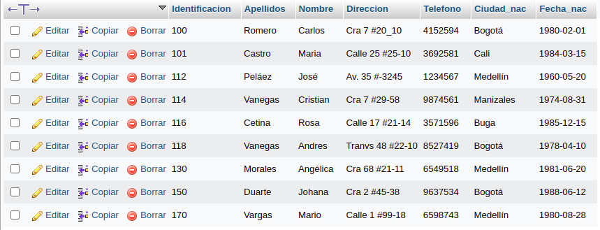

# consultas1

#CONSULTAS SQL

1. Para visualisar toda la informacion que contiene la tabla `usuario` se puede incluir con la instruccion SELECT el caracter '*' o cada uno de los campos de la tabla
`select * from usuario`

2. Visualizar solamente la identificacion del usuario.

`select identificacion from usuario`