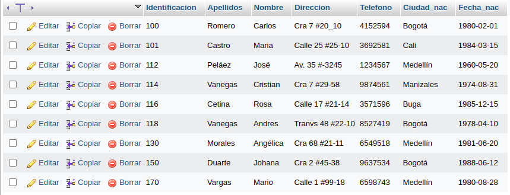
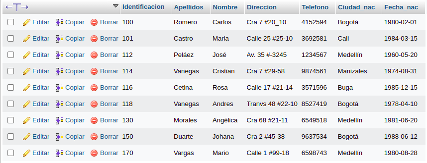
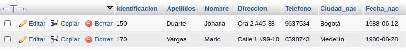
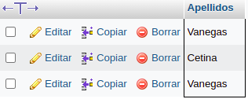
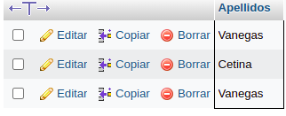
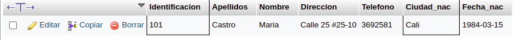
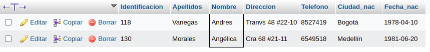
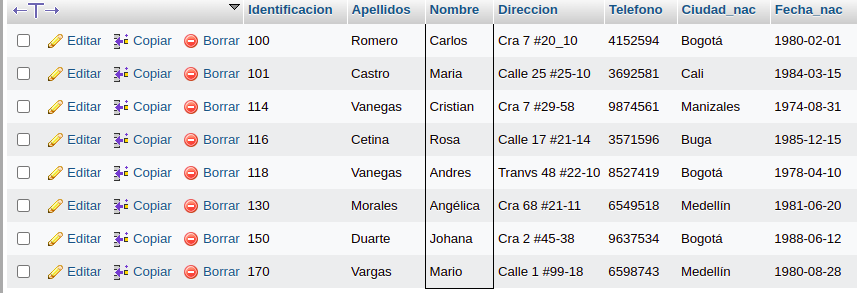
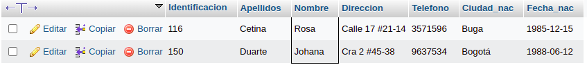
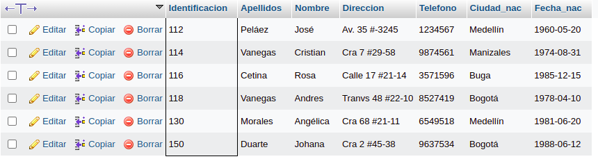

# consultas1

#  EJERCICIOS CONSULTAS SQL

## Tabla usuario

## COMANDO SELECT

1. Para visualisar toda la informacion que contiene la tabla `usuario` se puede incluir con la instruccion SELECT el caracter '*' o cada uno de los campos de la tabla
`select * from usuario` 

2. Visualizar solamente la identificacion del usuario.

`select identificacion from usuario`

3. Si se desea optener los registros cuya identificacion mayor o igual a 150 se debe utilizar la clausula WHERE que especifica las condiciones que debe reunir los registros que se van a seleccionar 

`SELECT * FROM usuario WHERE identificacion>=` '150'

4. Si se desea obtener los regitros cuyo sus apellidos sean Vnegas o Cetina se debe utilizar el operador IN que especifica los registros que se quieren visualizar de una tabla

`SELECT apellidos FROM usuario WHERE apellidos IN ('Vanegas','Cetina')`

O se puede utilizar el operador OR

`SELECT apellidos FROM usuario WHERE apellidos='Vanegas' OR apellidos='Cetina'`

5. Si se desea obtener los registros cuya identificacion sea menor de '110' y la ciudad sea 'Cali' se debe utilizar el operador AND

6. Si se desea obtener los registros cuyos nombres empiecen por la letra 'A' se debe utilizar el operador LIKE que utiliza los patrones'%' (todos) y '_' (caracter)

`SELECT * FROM usuario WHERE nombre LIKE'A%'`

7. Si desea obtener los registros cuyos nombres contengan la letra 'a' 

`SELECT * FROM usuario WHERE nombre LIKE '%a%'`

8. Si se desea obtener los registros donde la cuerta letra del nombre sea una 'a' 

`SELECT * FROM usuario WHERE nombre LIKE'   a%'`

9. Si se desea obtener los registros cuya identificaicon este entre el intervalo 110 y 150 se debe utilizar la clausula BETWEEN que sirve para especificar un intervalo de valores

`SELECT * FROM usuario WHERE identificacion BETWEE '110' AND '150'`

