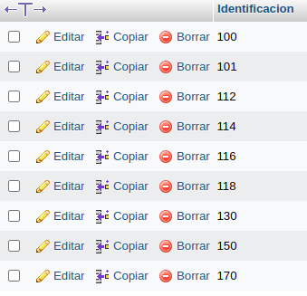

# consultas1

#  EJERCICIOS CONSULTAS SQL

## Tabla usuario

1. Para visualisar toda la informacion que contiene la tabla `usuario` se puede incluir con la instruccion SELECT el caracter '*' o cada uno de los campos de la tabla
`select * from usuario` 

2. Visualizar solamente la identificacion del usuario.

`select identificacion from usuario`

3. Si se desea optener los registros cuya identificacion mayor o igual a 150 se debe utilizar la clausula WHERE que especifica las condiciones que debe reunir los registros que se van a seleccionar 

`SELECT * FROM usuario WHERE identificacion>=` '150'

